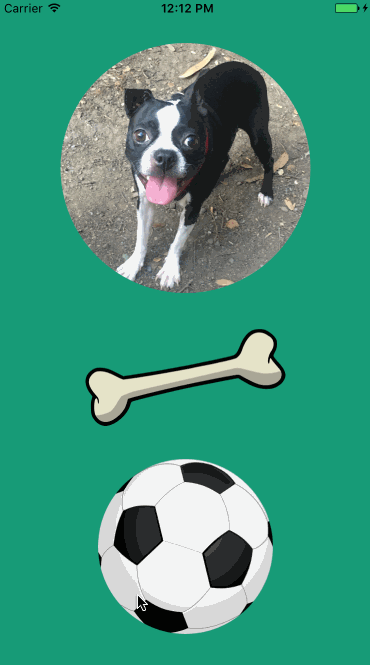

# SwiftUIKitExtensions
This is a small collection of useful extensions that I have gathered from various places in the world wide web. I've used the UIColor extension in just about every application I've worked on. I don't wish to take credit for any of this, rather I'd like to share some of the fun things I've found. Feel free to take and modify as you see fit for your personal projects.

## Custom UIColor by Hex
Define a color inside of the extension as a class function
```swift
class func emeraldGreen() -> UIColor {
    return UIColor(netHex: 0x169c78)
}
```
Then call it from anywhere like so
```swift
let yourViewController = UIViewController()
backgroundColor = UIColor.emeraldGreen()
```

## Wobble Animation
Wobble can be used on any UIView.
```swift
let someView = UIView()
someView.wobble()
```
To stop the animation, use
```swift
someView.stopWobbling()
```


## Shake Animation
Shake can be used on any UIView.
```swift
let anotherView = UIView()
anotherView.shake()
```

